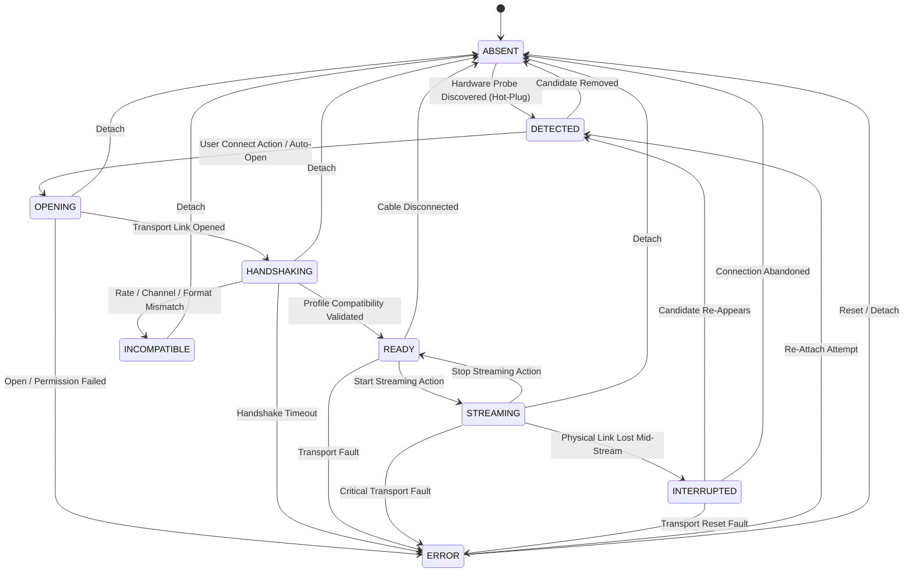

# 10 — Cihaz Çalışma Zamanı Temeli, USB Hazırlığı ve Donanım Rev-A Uyumu

## Bu nedir?

Bu doküman, AuscultaForge projesinde fiziksel ESP32-S3 donanımının ana bilgisayara bağlanmasına yönelik **Cihaz Çalışma Zamanı Temeli (Device Runtime Foundation)** ve **Hardware Rev-A Uyumlulaştırma (Reconciliation)** mimarisini açıklar.

Bu mimari fazının temel ilkeleri:
> 1. **"Fiziksel donanım henüz mevcut değilken varmış gibi davranmamak (No Fake Hardware Masquerade); ancak donanım masaya geldiği anda sisteme tam entegre olacak donanım-hazır (hardware-ready) soyutlama katmanını şimdiden tamamlamak."**
> 2. **"Donanım parametrelerini tek bir frekansa (örn. 4 kHz veya 48 kHz) kilitlememek; mimariyi merkezi bir Edinim Profili (`AcquisitionProfile`) üzerinden yapılandırmak."**
> 3. **"Fiziksel edinim hızı ile kullanıcı arayüzü çizim hızını kesin olarak ayrıştırmak; disk kaydında ham veriyi tam çözünürlükte korurken UI'da desimasyonlu tamponlama sağlamak."**

Uygulama başlangıçta sahte bir canlı cihaz akışıyla başlamaz. Donanım bağlı değilken gerçek sistem durumu dürüstçe `NO DEVICE CONNECTED / WAITING FOR AUSCULTAFORGE DEVICE` olarak bildirilir.

---

## 1. Cihaz Yaşam Döngüsü Durum Makinesi (Device Lifecycle State Machine)

Fiziksel bir medikal/akustik cihazın ana bilgisayara bağlanması, el sıkışması, akış başlatması ve olası bağlantı kopmalarını yönetmesi için 9 açık durumlu durum makinesi uygulanmıştır (`DeviceState`):



### Durumların Tanımları (9 Gerçek Durum)

1. **`ABSENT`:** Sistemde AuscultaForge donanım adayı algılanmamıştır. Varsayılan başlangıç durumudur.
2. **`DETECTED`:** İşletim sistemi veya discovery katmanı uyumlu bir USB adayı görmüştür; henüz transport açılmamıştır.
3. **`OPENING`:** Cihaz dosya tanıtıcısı / USB uç noktası açılmaktadır.
4. **`HANDSHAKING`:** Transport açılmıştır; protokol sürümü, örnekleme frekansı, kanal ve bit formatı aktif profile göre müzakere edilmektedir.
5. **`READY`:** El sıkışması doğrulanmış, cihaz parametreleri aktif edinim profiliyle onaylanmış ve veri akışına hazır duruma gelmiştir.
6. **`STREAMING`:** Cihazdan aktif olarak akustik paketler akmaktadır ve DSP boru hattına iletilmektedir.
7. **`INTERRUPTED`:** Akış sırasında fiziksel kablo çıkmış veya bağlantı beklenmedik biçimde kopmuştur.
8. **`ERROR`:** Transport açma veya G/Ç hatası meydana gelmiştir.
9. **`INCOMPATIBLE`:** Donanım el sıkışmasında desteklenmeyen protokol sürümü, geçersiz örnekleme hızı veya kanal uyumsuzluğu bildirmiştir.

> [!NOTE]
> **Yeniden Bağlanma Akışı:** Ayrı bir hayali `RECONNECTING` durumu yoktur. Kablo koptuğunda sistem `INTERRUPTED` durumuna geçer. Donanım yeniden göründüğünde deterministik sıra işletilir:
> `INTERRUPTED -> DETECTED -> OPENING -> HANDSHAKING -> READY`.

---

## 2. Merkezi Edinim Profili Modeli (`AcquisitionProfile`)

Eski kod tabanında 4000 Hz'e olan sabit donanım bağımlılığı kaldırılmış; tüm fiziksel edinim parametreleri merkezi bir yapılandırma modeline bağlanmıştır:

```python
@dataclass(slots=True)
class AcquisitionProfile:
    profile_id: str = "rev_a_pui_dmm4026"
    preferred_sample_rate_hz: int = 48000
    channels: int = 1
    sample_container_bits: int = 32
    meaningful_data_bits: int = 24
    sample_encoding: str = "signed_pcm"
    preferred_block_size: int = 512
    negotiated_block_size: int = 512
    description: str = "Hardware Rev-A baseline (PUI DMM-4026-B-I2S-R: 48 kHz mono 24-in-32 signed PCM)"
```

### Kritik Donanım Kavram Ayrımı: Slot Genişliği vs Anlamlı Bit vs Sensör Hassasiyeti

Hardware Rev-A tasarımında PUI DMM-4026-B-I2S-R mikrofonu ve ESP32-S3 I2S donanımı için şu ayrımlar kesin olarak yapılmalıdır:

1. **I2S Slot Genişliği (`sample_container_bits = 32`):**
   I2S bus üzerinde taşınan fiziksel yuva (slot) genişliğidir. DMA transferleri 32-bit kelimeler halinde yapılır.
2. **Anlamlı Veri Kelimesi (`meaningful_data_bits = 24`):**
   Mikrofonun I2S slotu içine sola veya sağa dayalı yerleştirdiği anlamlı dijital ses kelimesidir (data word).
3. **Efektif Sensör Hassasiyeti (Sensor Acoustic Precision / Dynamic Range):**
   **24-bit veri kelimesi taşınması, sensörün 24-bit analog hassasiyete sahip olduğu anlamına gelmez.** Akustik MEMS mikrofonun fiziksel diyaframı, termal gürültüsü ve dahili ASIC ADC'sinin efektif dinamik aralığı (SNR ve AOP - Acoustic Overload Point) mikrofonun akustik hassasiyet sınırını belirler. Yazılım katmanında "24-bit ADC hassasiyeti" iddiası yapılamaz; veri genişliği ile akustik hassasiyet kavramları ayrı tutulmalıdır.

---

## 3. Edinim Hızı vs Kullanıcı Arayüzü Çizim Hızı

Fiziksel donanım Rev-A önerisi **48,000 örnek/saniye (48 kHz)** edinim hızına odaklanmaktadır. Bu durum yazılım mimarisinde şu kritik prensibi zorunlu kılar:

> **"48 kHz fiziksel edinim, React kullanıcı arayüzünün saniyede 48.000 nokta çizmesi gerektiği anlamına gelmez."**

```text
48 kHz Donanım Edinimi (ESP32-S3 USB)
       │
       ▼
Host `DeviceSamplePacket` (Ham Tamsayı Yuva Verisi Korunur)
       │
       ▼
`packet_to_sample_block` (Float32 Normalizasyonu: -1.0 .. +1.0)
       │
       ├──────────────────────────────────────────┐
       ▼                                          ▼
Kayıt & DSP Boru Hattı                   Ekran Desimasyonu / Pencereli Tampon
- 48 kHz tam çözünürlüklü disk kaydı      - Ekran piksel çözünürlüğüne uygun min/max kutulama
- Sıfır alt-örnekleme (no downsampling)   - ~30-60 fps tarayıcı render döngüsü
- Bütünlüğü korunmuş WAV + metadata      - Tarayıcı thread'ini kilitlemeyen akış
```

- **Kayıt ve Analiz Bütünlüğü:** `SessionRecorder` ve `pcg_core` blokları gelen 48 kHz örnekleri doğrudan orijinal çözünürlüğünde saklar; kaydedilen sinyal hiçbir şekilde aşağı-örneklenmez (downsampled).
- **Arayüz Çizimi:** HTML5 Canvas osiloskop bileşeni, ekrandaki piksel genişliğine denk gelen zaman dilimlerinde min/max indeksleme (peak-bucketing) yaparak physiological dalga formunu 60 fps'te akıcı biçimde çizer.
- **Gecikme (Latency) İlkesi:** Laboratuvarda gerçek donanım bench ölçümleri yapılmadan uydurma gecikme rakamları (örn. "12 ms") telaffuz edilmez.

---

## 4. Yetenek Doğrulama ve Müzakere (`DeviceCapabilities`)

Cihaz bağlandığında (`HANDSHAKING`), donanım tarafından bildirilen yetenekler aktif `AcquisitionProfile` ile karşılaştırılır:
- **Protokol Sürümü:** `"1.0"` olmalıdır.
- **Kanal Sayısı:** Aktif profilin kanal sayısıyla eşleşmelidir (Rev-A mono: `1`).
- **Örnekleme Hızı:** Aktif profille birebir eşleşmelidir (`48000 Hz`). Eski geliştirme profili kullanılıyorsa `4000 Hz` kabul edilir.
- **Örnek Temsili:** `meaningful_data_bits <= sample_container_bits` olmalıdır.

Uyumsuzluk halinde cihaz `INCOMPATIBLE` durumuna çekilir ve denetim günlüğüne kaydedilir.

---

## 5. Taşıma Karar Sınırı (Transport Decision Boundary)

- **ESP32-S3 Yerel USB (Native USB):** Projenin Faz-1 kararı olarak kesinleşmiştir (final).
- **USB CDC-ACM:** Donanım Rev-A için önerilen ve ekip incelemesinde olan temel öneridir.
- **Yazılım Dürüstlüğü:**
  - Firmware ekibi USB VID/PID ve endpoint tanımlayıcılarını dondurana kadar ana bilgisayar uygulamasında **sahte bir seri port (COMx)**, sahte USB sürücüsü veya yapay baud hızı kullanıcı arayüzü oluşturulmamıştır.
  - `PendingDescriptorDiscoveryProvider` sisteme dürüstçe tanımlayıcıların beklendiğini raporlar.

---

## 6. Dürüst Çalışma Zamanı Bütünlük Telemetrisi (10 Sayaç)

Kullanıcı arayüzünde ve tanılama çekmecesinde yalnızca yazılım tarafından gerçekten hesaplanan 10 sayaç gösterilir; hiçbir dekoratif veya sıfır kalan yapay sayaç bulunmaz:

| Sayaç | Açıklama |
|---|---|
| `packets_received` | Donanımdan başarıyla alınan semantik paket sayısı |
| `samples_received` | İşlenen toplam ham ses örneği sayısı |
| `sequence_gaps` | Paket sıra numarası atlamaları (paket kaybı) |
| `repeated_packets` | Çift/tekrarlanan paket sıra numaraları |
| `out_of_order_packets` | Sırasız gelen paketler |
| `crc_failures` | CRC doğrulaması başarısız olan paketler |
| `malformed_frames` | Kod çözücü seviyesinde bozuk veya eksik çerçeveler |
| `timestamp_regressions` | Zaman damgasının geriye gitmesi (donanım timer hatası) |
| `disconnect_count` | Fiziksel bağlantı kopma sayısı |
| `reconnect_count` | Yeniden başarıyla bağlanma ve el sıkışma sayısı |

---

## 7. Bağlantı Kopması ve Güvenli Kayıt Mühürleme

Akış veya kayıt esnasında USB kablosu çekilirse:
1. `StreamManager.handle_device_disconnect()` çağrılır.
2. Aktif bir oturum kaydı varsa oturum havada bırakılmaz; anında WAV dosyası yazılır ve metadata yan dosyasına `termination_reason: "device_disconnected"` işlenir.
3. Cihaz durumu `INTERRUPTED` olarak güncellenir.
4. UI anında uyarı rozetini gösterir, kayıt butonu güvenli duruma geçer.

---

## 8. Donanım Rev-A ve PC Çalışma Zamanı Senkronizasyon Notu

> [!IMPORTANT]
> **Revizyon Kontrolü ve Ekip Senkronizasyonu:**<br/>
> Donanım Rev-A şematik/PCB tasarımı ile PC yazılımı çalışma zamanı parametreleri (I2S bit formatı, veri yerleşimi, USB endpoint adresleri, CRC polinomu) bağımsız olarak değiştirilemez. Tüm güncellemeler Git üzerinde revizyon kontrollü toplantı kararları ve mimari kararlar (ADR) ile eşzamanlı yürütülecektir.

---

## 9. 30 Saniyelik Bitirme Savunması Açıklaması

> *"AuscultaForge masaüstü uygulaması, donanım Rev-A mimarisine tam uyumlu, yapılandırılabilir bir edinim profili (`AcquisitionProfile`) ve 9 durumlu bir yaşam döngüsü durum makinesi üzerine kurulmuştur. Fiziksel donanım masaya gelene kadar sahte bir cihaz takılıymış gibi davranmıyoruz; sistem dürüstçe 'No Device' durumunda bekler. PUI DMM-4026-B-I2S-R mikrofonu için 48 kHz mono 24-in-32 bit edinim hızı hedeflenirken, PC çalışma zamanı disk kaydında tam 48 kHz çözünürlüğü korurken UI render döngüsünü desimasyonla ayırır. Kablo kopması esnasında kayıtların mühürlenmesi ve el sıkışma uyumluluğu otomatik testlerle kanıtlanmıştır."*
